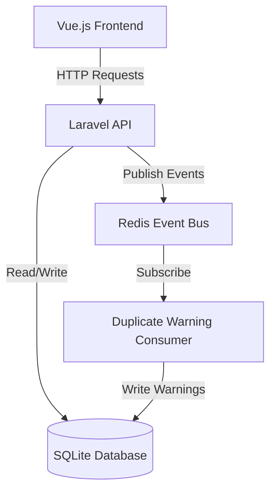

# Design Document: canoe-app-funds

## Overview

The canoe-app-funds system is a Laravel-based API service that manages investment fund data with an event-driven architecture for duplicate detection. The system consists of three main layers:

1. **API Layer**: RESTful endpoints for CRUD operations on Funds, Fund Managers, and Companies
2. **Event Layer**: Redis-based event system for asynchronous duplicate detection
3. **UI Layer**: Vue.js frontend for user interaction

The architecture emphasizes data integrity through soft deletes, referential consistency, and proactive duplicate detection. The event-driven approach decouples duplicate detection from the main request flow, ensuring responsive API performance while maintaining data quality.

## Architecture

### High-Level Architecture



### Component Responsibilities

**Laravel API Service**:
- Handle HTTP requests for CRUD operations
- Validate input data
- Manage database transactions
- Emit duplicate detection events to Redis
- Serve API responses

**Redis Event Bus**:
- Queue duplicate_fund_warning events
- Decouple duplicate detection from request processing
- Ensure reliable event delivery

**Duplicate Warning Consumer**:
- Subscribe to duplicate_fund_warning events
- Persist warnings to database
- Run as a background process (Laravel queue worker)

**Vue.js Frontend**:
- Provide user interface for fund management
- Display lists with filtering capabilities
- Handle form submissions for create/update operations
- Display duplicate warnings

### Technology Stack Rationale

- **Laravel**: Provides robust ORM (Eloquent), built-in soft delete support, event system, and queue management
- **SQLite**: Lightweight database suitable for the data model complexity
- **Redis**: Fast, reliable message broker for event-driven architecture
- **Vue.js**: Reactive framework for building interactive user interfaces

## Components and Interfaces

### Database Schema

#### Funds Table
```sql
CREATE TABLE funds (
    id INTEGER PRIMARY KEY AUTOINCREMENT,
    name VARCHAR(255) NOT NULL,
    start_year INTEGER NOT NULL,
    fund_manager_id INTEGER NOT NULL,
    deleted_at TIMESTAMP NULL,
    created_at TIMESTAMP DEFAULT CURRENT_TIMESTAMP,
    updated_at TIMESTAMP DEFAULT CURRENT_TIMESTAMP,
    FOREIGN KEY (fund_manager_id) REFERENCES fund_managers(id)
);

CREATE INDEX idx_funds_name ON funds(name);
CREATE INDEX idx_funds_manager ON funds(fund_manager_id);
CREATE INDEX idx_funds_year ON funds(start_year);
CREATE INDEX idx_funds_deleted ON funds(deleted_at);
```

#### Fund Managers Table
```sql
CREATE TABLE fund_managers (
    id INTEGER PRIMARY KEY AUTOINCREMENT,
    name VARCHAR(255) NOT NULL UNIQUE,
    deleted_at TIMESTAMP NULL,
    created_at TIMESTAMP DEFAULT CURRENT_TIMESTAMP,
    updated_at TIMESTAMP DEFAULT CURRENT_TIMESTAMP
);

CREATE INDEX idx_fund_managers_deleted ON fund_managers(deleted_at);
```

#### Companies Table
```sql
CREATE TABLE companies (
    id INTEGER PRIMARY KEY AUTOINCREMENT,
    name VARCHAR(255) NOT NULL UNIQUE,
    deleted_at TIMESTAMP NULL,
    created_at TIMESTAMP DEFAULT CURRENT_TIMESTAMP,
    updated_at TIMESTAMP DEFAULT CURRENT_TIMESTAMP
);

CREATE INDEX idx_companies_deleted ON companies(deleted_at);
```

#### Aliases Table
```sql
CREATE TABLE aliases (
    id INTEGER PRIMARY KEY AUTOINCREMENT,
    name VARCHAR(255) NOT NULL,
    fund_id INTEGER NOT NULL,
    created_at TIMESTAMP DEFAULT CURRENT_TIMESTAMP,
    updated_at TIMESTAMP DEFAULT CURRENT_TIMESTAMP,
    FOREIGN KEY (fund_id) REFERENCES funds(id) ON DELETE CASCADE,
    UNIQUE(name)
);

CREATE INDEX idx_aliases_fund ON aliases(fund_id);
CREATE INDEX idx_aliases_name ON aliases(name);
```

#### Fund-Company Pivot Table
```sql
CREATE TABLE company_fund (
    id INTEGER PRIMARY KEY AUTOINCREMENT,
    fund_id INTEGER NOT NULL,
    company_id INTEGER NOT NULL,
    created_at TIMESTAMP DEFAULT CURRENT_TIMESTAMP,
    FOREIGN KEY (fund_id) REFERENCES funds(id) ON DELETE CASCADE,
    FOREIGN KEY (company_id) REFERENCES companies(id) ON DELETE CASCADE,
    UNIQUE(fund_id, company_id)
);

CREATE INDEX idx_company_fund_fund ON company_fund(fund_id);
CREATE INDEX idx_company_fund_company ON company_fund(company_id);
```

#### Duplicate Warnings Table
```sql
CREATE TABLE duplicate_warnings (
    id INTEGER PRIMARY KEY AUTOINCREMENT,
    fund_id_1 INTEGER NOT NULL,
    fund_id_2 INTEGER NOT NULL,
    resolved BOOLEAN DEFAULT FALSE,
    created_at TIMESTAMP DEFAULT CURRENT_TIMESTAMP,
    updated_at TIMESTAMP DEFAULT CURRENT_TIMESTAMP,
    FOREIGN KEY (fund_id_1) REFERENCES funds(id),
    FOREIGN KEY (fund_id_2) REFERENCES funds(id)
);

CREATE INDEX idx_duplicate_warnings_resolved ON duplicate_warnings(resolved);
CREATE INDEX idx_duplicate_warnings_funds ON duplicate_warnings(fund_id_1, fund_id_2);
```

### API Endpoints

#### Fund Endpoints

**POST /api/funds**
- Create a new Fund
- Request Body:
```json
{
  "name": "string",
  "start_year": "integer",
  "fund_manager_id": "integer",
  "aliases": ["string"],
  "company_ids": ["integer"]
}
```
- Response: 201 Created with Fund object
- Triggers: duplicate_fund_warning event

**GET /api/funds**
- List Funds with optional filters
- Query Parameters:
  - `name`: Filter by fund name (partial match)
  - `fund_manager_id`: Filter by fund manager
  - `start_year`: Filter by start year
  - `company_id`: Filter by associated company
- Response: 200 OK with array of Fund objects

**GET /api/funds/{id}**
- Get a single Fund by ID
- Response: 200 OK with Fund object including aliases and companies

**PUT /api/funds/{id}**
- Update an existing Fund
- Request Body: Same as POST (all fields optional)
- Response: 200 OK with updated Fund object
- Triggers: duplicate_fund_warning event

**DELETE /api/funds/{id}**
- Soft delete a Fund
- Response: 204 No Content

#### Fund Manager Endpoints

**POST /api/fund-managers**
- Create a new Fund Manager
- Request Body:
```json
{
  "name": "string"
}
```
- Response: 201 Created with Fund Manager object

**GET /api/fund-managers**
- List all Fund Managers (excluding soft-deleted)
- Response: 200 OK with array of Fund Manager objects

**DELETE /api/fund-managers/{id}**
- Soft delete a Fund Manager
- Response: 204 No Content

#### Company Endpoints

**POST /api/companies**
- Create a new Company
- Request Body:
```json
{
  "name": "string"
}
```
- Response: 201 Created with Company object

**GET /api/companies**
- List all Companies (excluding soft-deleted)
- Response: 200 OK with array of Company objects

**DELETE /api/companies/{id}**
- Soft delete a Company
- Response: 204 No Content

#### Duplicate Warning Endpoints

**GET /api/duplicate-warnings**
- List unresolved duplicate warnings
- Response: 200 OK with array of warning objects including full Fund details

### Event Schema

**duplicate_fund_warning Event**
```json
{
  "event": "duplicate_fund_warning",
  "payload": {
    "fund_id_1": "integer",
    "fund_id_2": "integer",
    "detected_at": "timestamp"
  }
}
```

### Laravel Models

**Fund Model**:
- Relationships: belongsTo(FundManager), hasMany(Alias), belongsToMany(Company)
- Soft Deletes: Enabled
- Events: Dispatches duplicate detection on create/update

**FundManager Model**:
- Relationships: hasMany(Fund)
- Soft Deletes: Enabled

**Company Model**:
- Relationships: belongsToMany(Fund)
- Soft Deletes: Enabled

**Alias Model**:
- Relationships: belongsTo(Fund)
- Validation: Unique across all funds and aliases

**DuplicateWarning Model**:
- Relationships: belongsTo(Fund) for both fund_id_1 and fund_id_2
- Scope: unresolved() for filtering

### Vue.js Component Structure

**FundList.vue**:
- Display paginated list of funds
- Implement filter controls
- Handle delete actions

**FundForm.vue**:
- Create/Edit form for funds
- Dynamic alias input fields
- Multi-select for companies
- Validation feedback

**DuplicateWarningList.vue**:
- Display unresolved warnings
- Show side-by-side fund comparison
- Provide resolution actions

**FilterBar.vue**:
- Reusable filter component
- Emit filter change events

## Data Models

### Fund Entity
```php
class Fund extends Model
{
    use SoftDeletes;
    
    protected $fillable = ['name', 'start_year', 'fund_manager_id'];
    
    protected $casts = [
        'start_year' => 'integer',
        'deleted_at' => 'datetime'
    ];
    
    public function fundManager()
    {
        return $this->belongsTo(FundManager::class);
    }
    
    public function aliases()
    {
        return $this->hasMany(Alias::class);
    }
    
    public function companies()
    {
        return $this->belongsToMany(Company::class);
    }
}
```

### FundManager Entity
```php
class FundManager extends Model
{
    use SoftDeletes;
    
    protected $fillable = ['name'];
    
    protected $casts = [
        'deleted_at' => 'datetime'
    ];
    
    public function funds()
    {
        return $this->hasMany(Fund::class);
    }
}
```

### Company Entity
```php
class Company extends Model
{
    use SoftDeletes;
    
    protected $fillable = ['name'];
    
    protected $casts = [
        'deleted_at' => 'datetime'
    ];
    
    public function funds()
    {
        return $this->belongsToMany(Fund::class);
    }
}
```

### Alias Entity
```php
class Alias extends Model
{
    protected $fillable = ['name', 'fund_id'];
    
    public function fund()
    {
        return $this->belongsTo(Fund::class);
    }
}
```

### DuplicateWarning Entity
```php
class DuplicateWarning extends Model
{
    protected $fillable = ['fund_id_1', 'fund_id_2', 'resolved'];
    
    protected $casts = [
        'resolved' => 'boolean',
        'created_at' => 'datetime',
        'updated_at' => 'datetime'
    ];
    
    public function fund1()
    {
        return $this->belongsTo(Fund::class, 'fund_id_1');
    }
    
    public function fund2()
    {
        return $this->belongsTo(Fund::class, 'fund_id_2');
    }
    
    public function scopeUnresolved($query)
    {
        return $query->where('resolved', false);
    }
}
```

### Duplicate Detection Service

```php
class DuplicateDetectionService
{
    public function checkForDuplicates(Fund $fund): void
    {
        $fundManagerId = $fund->fund_manager_id;
        
        // Get all funds from same manager (excluding current fund)
        $existingFunds = Fund::where('fund_manager_id', $fundManagerId)
            ->where('id', '!=', $fund->id)
            ->whereNull('deleted_at')
            ->with('aliases')
            ->get();
        
        $fundNames = [$fund->name];
        $fundAliases = $fund->aliases->pluck('name')->toArray();
        $allFundIdentifiers = array_merge($fundNames, $fundAliases);
        
        foreach ($existingFunds as $existingFund) {
            $existingNames = [$existingFund->name];
            $existingAliases = $existingFund->aliases->pluck('name')->toArray();
            $allExistingIdentifiers = array_merge($existingNames, $existingAliases);
            
            // Case-insensitive comparison
            foreach ($allFundIdentifiers as $identifier) {
                foreach ($allExistingIdentifiers as $existingIdentifier) {
                    if (strcasecmp($identifier, $existingIdentifier) === 0) {
                        $this->emitDuplicateWarning($fund->id, $existingFund->id);
                        break 2; // Exit both loops once duplicate found
                    }
                }
            }
        }
    }
    
    private function emitDuplicateWarning(int $fundId1, int $fundId2): void
    {
        event(new DuplicateFundWarning($fundId1, $fundId2));
    }
}
```


## Correctness Properties

*A property is a characteristic or behavior that should hold true across all valid executions of a system—essentially, a formal statement about what the system should do. Properties serve as the bridge between human-readable specifications and machine-verifiable correctness guarantees.*

### Property 1: Entity Persistence Round-Trip

*For any* valid Fund, Fund_Manager, or Company entity, creating it and then retrieving it should return an entity with identical field values.

**Validates: Requirements 1.1, 2.1, 3.1**

### Property 2: Fund-Manager Referential Integrity

*For any* Fund in the system, it must be associated with exactly one Fund_Manager, and that Fund_Manager must exist in the database.

**Validates: Requirements 1.2**

### Property 3: Alias Uniqueness Constraint

*For any* Alias name, it must not match any existing Fund name or any other Alias name in the system (case-insensitive comparison).

**Validates: Requirements 1.5**

### Property 4: Relationship Cardinality Preservation

*For any* Fund with N aliases and M company associations, retrieving that Fund should return exactly N aliases and M company associations.

**Validates: Requirements 1.3, 1.4, 1.6, 2.2, 3.2**

### Property 5: Fund Creation Completeness

*For any* valid Fund creation request with aliases and company associations, the created Fund should exist in the database with all specified aliases and company associations correctly linked.

**Validates: Requirements 4.1, 4.2, 4.3**

### Property 6: Invalid Data Rejection

*For any* Fund creation request with invalid data (missing required fields, non-existent Fund_Manager, etc.), the API should return an error and not create any database records.

**Validates: Requirements 4.4**

### Property 7: Duplicate Detection Event Emission

*For any* Fund creation or update operation, if the Fund's name or any alias matches (case-insensitive) an existing Fund name or alias for the same Fund_Manager, a duplicate_fund_warning event should be emitted to Redis containing both Fund identifiers.

**Validates: Requirements 4.5, 6.5, 10.1, 10.2, 10.3, 10.4, 10.5**

### Property 8: Soft Delete Exclusion

*For any* entity (Fund, Fund_Manager, or Company) that has been soft-deleted, it should not appear in any list or filter operation results.

**Validates: Requirements 5.1, 5.6, 7.3, 8.4, 9.3**

### Property 9: Name Filter Correctness

*For any* name filter value, all Funds returned by the list endpoint should have names that match the filter (partial, case-insensitive match).

**Validates: Requirements 5.2**

### Property 10: Fund Manager Filter Correctness

*For any* Fund_Manager ID filter, all Funds returned by the list endpoint should be associated with that Fund_Manager.

**Validates: Requirements 5.3**

### Property 11: Year Filter Correctness

*For any* year filter value, all Funds returned by the list endpoint should have a start_year equal to that value.

**Validates: Requirements 5.4**

### Property 12: Company Filter Correctness

*For any* Company ID filter, all Funds returned by the list endpoint should be associated with that Company.

**Validates: Requirements 5.5**

### Property 13: Fund Update Completeness

*For any* existing Fund and valid update request (including alias and company changes), the updated Fund should reflect all changes: modified fields, added/removed aliases, and added/removed company associations.

**Validates: Requirements 6.1, 6.2, 6.3**

### Property 14: Soft Delete Preservation

*For any* entity (Fund, Fund_Manager, or Company) that is soft-deleted, all its relationships and associated data should remain in the database unchanged except for the deleted_at timestamp.

**Validates: Requirements 7.1, 7.2, 8.1, 8.2, 9.1, 9.2**

### Property 15: Warning Persistence Completeness

*For any* duplicate_fund_warning event received by the consumer, a DuplicateWarning record should be created in the database with both Fund IDs, a timestamp, and resolved status set to false.

**Validates: Requirements 11.1, 11.2, 11.3**

### Property 16: Unresolved Warnings Filter

*For any* request to list duplicate warnings, all returned warnings should have resolved status set to false, and should include complete Fund details for both associated Funds.

**Validates: Requirements 12.1, 12.2, 12.3**

## Error Handling

### Validation Errors

**Input Validation**:
- All API endpoints validate required fields before processing
- Return 422 Unprocessable Entity with detailed error messages
- Error response format:
```json
{
  "message": "Validation failed",
  "errors": {
    "field_name": ["Error message 1", "Error message 2"]
  }
}
```

**Business Rule Violations**:
- Alias uniqueness violations return 409 Conflict
- Non-existent foreign key references return 404 Not Found
- Duplicate detection does not block operations (warnings are asynchronous)

### Database Errors

**Transaction Management**:
- All write operations wrapped in database transactions
- Rollback on any failure to maintain consistency
- Log errors for debugging and monitoring

**Constraint Violations**:
- Foreign key violations return 400 Bad Request
- Unique constraint violations return 409 Conflict
- Cascade deletes handled by database for aliases and pivot records

### Event System Errors

**Redis Connection Failures**:
- Log error and continue (duplicate detection is non-blocking)
- Implement retry logic with exponential backoff
- Alert monitoring system for persistent failures

**Consumer Processing Errors**:
- Failed event processing logged with full context
- Events remain in queue for retry
- Dead letter queue for events that fail repeatedly

### API Error Responses

**Standard HTTP Status Codes**:
- 200 OK: Successful GET requests
- 201 Created: Successful POST requests
- 204 No Content: Successful DELETE requests
- 400 Bad Request: Invalid request format
- 404 Not Found: Resource not found
- 409 Conflict: Business rule violation
- 422 Unprocessable Entity: Validation failure
- 500 Internal Server Error: Unexpected server errors

## Testing Strategy

### Dual Testing Approach

The testing strategy employs both unit tests and property-based tests to ensure comprehensive coverage:

**Unit Tests**: Focus on specific examples, edge cases, and integration points
- Specific example scenarios (e.g., creating a fund with 3 aliases)
- Edge cases (e.g., empty alias arrays, maximum field lengths)
- Error conditions (e.g., invalid Fund_Manager ID)
- Integration between components (e.g., API controller to service layer)

**Property-Based Tests**: Verify universal properties across randomized inputs
- Generate random valid and invalid data
- Test properties that should hold for all inputs
- Minimum 100 iterations per property test
- Each test references its design document property

### Property-Based Testing Configuration

**Framework**: Use **PHPUnit** with **Faker** for property-based testing in Laravel

**Test Structure**:
```php
/**
 * @test
 * @group property-based
 * @group canoe-app-funds
 */
public function it_satisfies_property_1_entity_persistence_round_trip()
{
    // Feature: canoe-app-funds, Property 1: Entity Persistence Round-Trip
    
    for ($i = 0; $i < 100; $i++) {
        $fundManager = FundManager::factory()->create();
        $originalData = [
            'name' => fake()->company(),
            'start_year' => fake()->year(),
            'fund_manager_id' => $fundManager->id
        ];
        
        $fund = Fund::create($originalData);
        $retrieved = Fund::find($fund->id);
        
        $this->assertEquals($originalData['name'], $retrieved->name);
        $this->assertEquals($originalData['start_year'], $retrieved->start_year);
        $this->assertEquals($originalData['fund_manager_id'], $retrieved->fund_manager_id);
    }
}
```

**Test Organization**:
- Property tests in `tests/Feature/Properties/`
- Unit tests in `tests/Feature/` and `tests/Unit/`
- Tag all property tests with `@group property-based` and `@group canoe-app-funds`
- Use Laravel factories for generating test data

### Unit Testing Focus Areas

**API Endpoints**:
- Request validation
- Response format verification
- HTTP status codes
- Authentication and authorization (if applicable)

**Service Layer**:
- Duplicate detection logic
- Filter query building
- Soft delete behavior

**Event System**:
- Event emission verification
- Consumer processing
- Redis integration

**Database**:
- Migration correctness
- Model relationships
- Constraint enforcement

### Test Data Generation

**Laravel Factories**:
- Create factories for all models
- Support various states (with/without aliases, soft-deleted, etc.)
- Generate realistic random data using Faker

**Example Factory**:
```php
class FundFactory extends Factory
{
    public function definition(): array
    {
        return [
            'name' => fake()->company() . ' Fund',
            'start_year' => fake()->numberBetween(1990, 2024),
            'fund_manager_id' => FundManager::factory()
        ];
    }
    
    public function withAliases(int $count = 3): static
    {
        return $this->has(Alias::factory()->count($count));
    }
    
    public function deleted(): static
    {
        return $this->state(fn (array $attributes) => [
            'deleted_at' => now()
        ]);
    }
}
```

### Integration Testing

**API Integration Tests**:
- Full request/response cycle
- Database state verification
- Event emission verification

**Event System Integration**:
- End-to-end duplicate detection flow
- Redis event publishing and consumption
- Warning persistence verification

### Performance Considerations

**Query Optimization**:
- Test N+1 query prevention with eager loading
- Verify index usage for filtered queries
- Monitor query performance with large datasets

**Event Processing**:
- Test consumer throughput
- Verify queue processing under load
- Monitor Redis memory usage

### Coverage Goals

- Minimum 80% code coverage for business logic
- 100% coverage of all correctness properties
- All acceptance criteria validated by at least one test
- All error paths tested with unit tests
